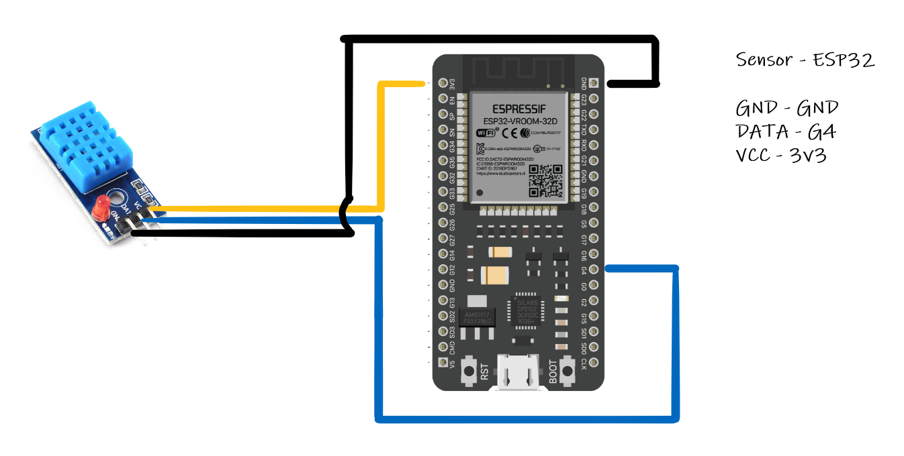

# IoT Dashboard: MQTT, Telegraf, InfluxDB, Grafana

This project demonstrates how to monitor the temperature and humidity using an ESP32 microcontroller connected to
a DHT11 sensor. The integrated Wi-Fi of ESP32 is utilized and the data is then transmitted via MQTT to the backend which
is hosted on a Raspberry Pi. The backend system consists of a local MQTT broker, Telegraf, InfluxDB, and Grafana
for visualization.

## Table of Contents

<!-- TOC -->
* [IoT Dashboard: MQTT, Telegraf, InfluxDB, Grafana](#iot-dashboard-mqtt-telegraf-influxdb-grafana)
  * [Table of Contents](#table-of-contents)
  * [Hardware Requirements](#hardware-requirements)
  * [Linux Development Environment](#linux-development-environment)
    * [Pre-requisites](#pre-requisites)
    * [Installation](#installation)
  * [ESP32 - DHT11 connectivity](#esp32---dht11-connectivity)
<!-- TOC -->

## Hardware Requirements

- [ESP32 System-on-a-Chip (SoC)](https://www.espressif.com/en/products/socs/esp32)
- [DHT11 - Temperature and Humidity Sensor](https://components101.com/sensors/dht11-temperature-sensor)

## Linux Development Environment

> This project has been developed using Debian 12 (bookworm).

Here, the set-up procedure for Linux systems will be described. However, it wouldn't be that different for Mac
or Windows OS.

### Pre-requisites

- [Python 3.12.2](https://www.python.org/downloads/release/python-3122/)
- [Git](https://git-scm.com/book/en/v2/Getting-Started-Installing-Git)
- [Docker](https://docs.docker.com/engine/install/)
- [Pyenv](https://github.com/pyenv/pyenv) (optional)

> We recommend to use `pyenv` for installing and managing various Python version in simple way.

### Installation

1. Clone this repository to your local machine.

```shell
git clone https://github.com/vasilogi/LocalWeather-Reader.git 
```

2. Navigate inside the directory, containing the repository and create a Python virtual environment.

```shell
python -m venv .venv
```

3. Install the necessary requirements.

```shell
pip install -r requirements.txt
```

## ESP32 - DHT11 connectivity

Connect the DHT11 sensor to the ESP32 board. The connections typically include VCC, GND, and data pins. Advice the
current configuration below:


