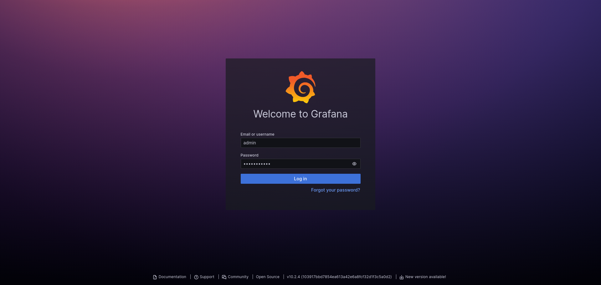
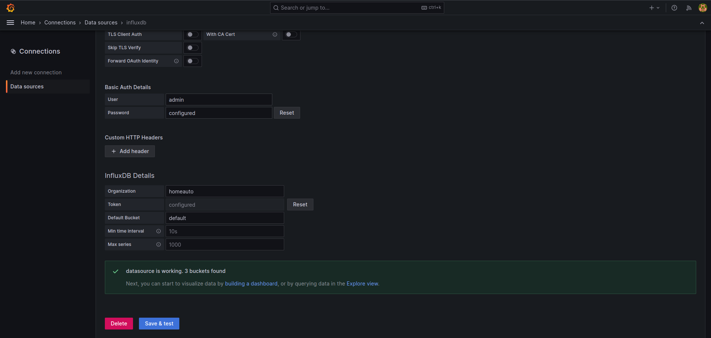
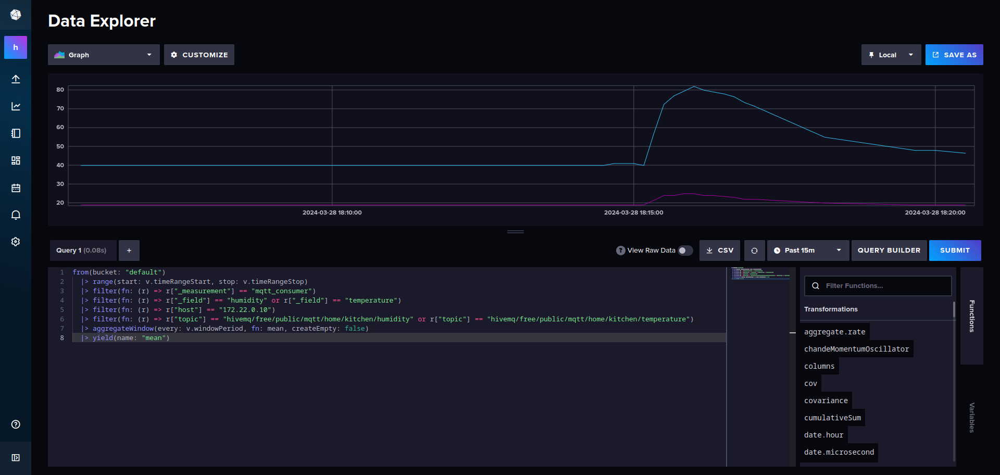
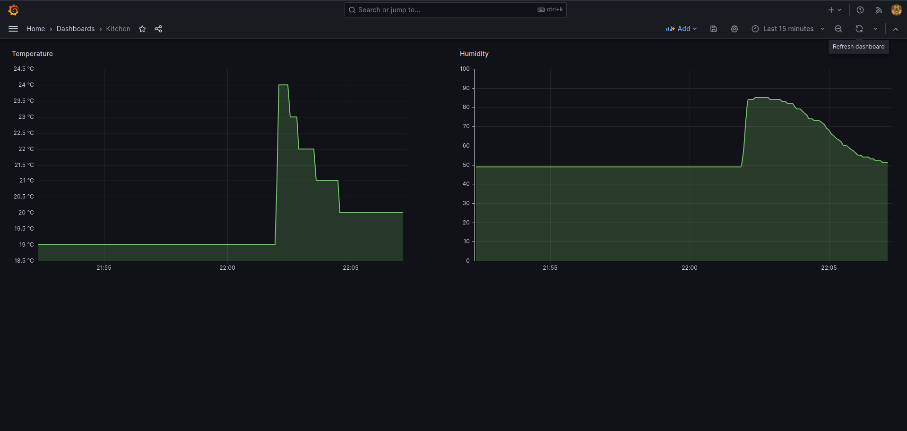

# IoT Dashboard: MQTT, Telegraf, InfluxDB, Grafana

This project demonstrates how to monitor the temperature and humidity using an ESP32 microcontroller connected to
a DHT11 sensor. The integrated Wi-Fi of ESP32 is utilized and the data is then transmitted via MQTT to the backend which
is hosted on a Raspberry Pi. The backend system consists of a local MQTT broker, Telegraf, InfluxDB, and Grafana
for visualization. 🌡️📈

## Table of Contents

<!-- TOC -->
* [IoT Dashboard: MQTT, Telegraf, InfluxDB, Grafana](#iot-dashboard-mqtt-telegraf-influxdb-grafana)
  * [Table of Contents](#table-of-contents)
  * [Hardware Requirements 🛠️](#hardware-requirements-)
  * [Set up a Linux Development Environment 🐧](#set-up-a-linux-development-environment-)
    * [Pre-requisites](#pre-requisites)
    * [Installation 📦](#installation-)
      * [1. Clone this repository to your local machine.](#1-clone-this-repository-to-your-local-machine)
      * [2. Navigate inside the directory, containing the repository and create a Python virtual environment.](#2-navigate-inside-the-directory-containing-the-repository-and-create-a-python-virtual-environment)
      * [4. Activate the virtual environment:](#4-activate-the-virtual-environment)
      * [5. Install the necessary requirements.](#5-install-the-necessary-requirements)
  * [Set up the ESP32 microcontroller](#set-up-the-esp32-microcontroller)
    * [Hardware wiring 🧩](#hardware-wiring-)
    * [Getting connected with the ESP32 🔄](#getting-connected-with-the-esp32-)
      * [Powering the board 🔌](#powering-the-board-)
      * [Downloading the MicroPython firmware 📥](#downloading-the-micropython-firmware-)
      * [Flashing the MicroPython firmware into the ESP32 📲](#flashing-the-micropython-firmware-into-the-esp32-)
      * [Loading the source code into the EPS32 📥](#loading-the-source-code-into-the-eps32-)
  * [Set up the monitoring stack 📊](#set-up-the-monitoring-stack--)
    * [Parse MQTT Data to Telegraf, Store with InfluxDB and Visualise with Grafana](#parse-mqtt-data-to-telegraf-store-with-influxdb-and-visualise-with-grafana)
    * [Prerequisites](#prerequisites)
    * [Building images and spinning up containers](#building-images-and-spinning-up-containers)
    * [Exploring Data in InfluxDB Data Explorer](#exploring-data-in-influxdb-data-explorer)
    * [Configuring InfluxDB Data Source in Grafana 🚀](#configuring-influxdb-data-source-in-grafana--)
    * [Visualise time-series data using Grafana 📊](#visualise-time-series-data-using-grafana--)
<!-- TOC -->

## Hardware Requirements 🛠️

- [ESP32 System-on-a-Chip (SoC)](https://www.espressif.com/en/products/socs/esp32)
- [DHT11 - Temperature and Humidity Sensor](https://components101.com/sensors/dht11-temperature-sensor)
- [Raspberry Pi](https://www.raspberrypi.com/) or a Personal Computer

## Set up a Linux Development Environment 🐧

> This project has been developed using Debian 12 (bookworm).

Here, the set-up procedure for Linux systems will be described. However, it wouldn't be that different for Mac
or Windows OS.

### Pre-requisites

- [Python 3.12.2](https://www.python.org/downloads/release/python-3122/)
- [Git](https://git-scm.com/book/en/v2/Getting-Started-Installing-Git)
- [Docker](https://docs.docker.com/engine/install/)
- [Pyenv](https://github.com/pyenv/pyenv) (optional)

> We recommend to use `pyenv` for installing and managing various Python version in simple way.

### Installation 📦

#### 1. Clone this repository to your local machine.

```shell
git clone https://github.com/vasilogi/LocalWeather-Reader.git 
```

#### 2. Navigate inside the directory, containing the repository and create a Python virtual environment.

```shell
python -m venv .venv
```

#### 4. Activate the virtual environment:

```shell
source .vevn/bin/activate
```

#### 5. Install the necessary requirements.

```shell
pip install -r requirements.txt
```

## Set up the ESP32 microcontroller

### Hardware wiring 🧩

Connect the DHT11 sensor to the ESP32 board. The connections typically include VCC, GND, and data pins. Advice the
current configuration below:


### Getting connected with the ESP32 🔄

#### Powering the board 🔌

Your board has a micro USB connector on it, and it is powered through this when connected to your development machine.
Therefore, simply connect a micro USB cable to it.

#### Downloading the MicroPython firmware 📥

You can download the most recent MicroPython firmware **.bin file** to load onto your ESP32 device from the
[MicroPython downloads page](https://micropython.org/download/ESP32_GENERIC/). In this project, we are going to use the
[v.1.22.2](./esp32_firmware/ESP32_GENERIC-20240222-v1.22.2.bin).

#### Flashing the MicroPython firmware into the ESP32 📲

In your Python virtual environment that you have installed, we have included the `esptool.py` package.
You will use this open-source and platform-agnostic utility to communicate with the ROM bootloader in your ESP32 chip.
Thus, first activate the virtual environment as explained above in the [installation instructions](#installation-).

Then, erase the flash memory by running the following command:

```shell
esptool.py --chip esp32 --port /dev/ttyUSB0 erase_flash
```

Upon success, you should be expecting a message like this:

```shell
esptool.py v4.7.0
Serial port /dev/ttyUSB0
Connecting.......
Chip is ESP32-D0WDQ6 (revision v1.0)
Features: WiFi, BT, Dual Core, 240MHz, VRef calibration in efuse, Coding Scheme None
Crystal is 40MHz
MAC: 7c:9e:bd:61:5f:48
Uploading stub...
Running stub...
Stub running...
Erasing flash (this may take a while)...
Chip erase completed successfully in 5.8s
Hard resetting via RTS pin...
```

Now, you are ready to flash the MicroPython firmware onto the ESP32 by running:

```shell
esptool.py --chip esp32 --port /dev/ttyUSB0 --baud 460800 write_flash -z 0x1000 ./esp32_firmware/ESP32_GENERIC-20240222-v1.22.2.bin
```

You should be seeing in your terminal a similar to this message:

```shell
esptool.py v4.7.0
Serial port /dev/ttyUSB0
Connecting....
Chip is ESP32-D0WDQ6 (revision v1.0)
Features: WiFi, BT, Dual Core, 240MHz, VRef calibration in efuse, Coding Scheme None
Crystal is 40MHz
MAC: 7c:9e:bd:61:5f:48
Uploading stub...
Running stub...
Stub running...
Changing baud rate to 460800
Changed.
Configuring flash size...
Flash will be erased from 0x00001000 to 0x001a9fff...
Compressed 1737776 bytes to 1143554...
Wrote 1737776 bytes (1143554 compressed) at 0x00001000 in 25.8 seconds (effective 539.4 kbit/s)...
Hash of data verified.

Leaving...
Hard resetting via RTS pin...
```

Super! You have successfully flashed the MicroPython firmware onto your ESP32! ✨

#### Loading the source code into the EPS32 📥

Now you can transfer your MicroPython code to the ESP32 using `adafruit-ampy`. `Ampy` is a tool to control MicroPython
boards over a serial connection. Using it, you can manipulate files on the board's filesystem and even run scripts.
Assuming that you have navigated within the `microcontroller` directory from the root of this project, you can view the
help manual of `ampy` by running:

```shell
ampy --help
```

Let's first list the contents of the root of the filesystem on the board by running:

```shell
ampy --port /dev/ttyUSB0 ls
```

Most probably, you should be seeing just a `boot.py` file.

Therefore, let's move our source code onto the ESP32 by running:

```shell
ampy --port /dev/ttyUSB0 put *.py
ampy --port /dev/ttyUSB0 put config.json 
ampy --port /dev/ttyUSB0 put src/
```

> In case you are using some IDE that is connected already with board, e.g. [Thonny](https://thonny.org/)
> you will need to close it in order to successfully transfer the code.

You can verify the transfer by running:

```shell
ampy --port /dev/ttyUSB0 ls
```

and it should look like below:

```shell
/boot.py
/config.json
/main.py
/src
```

> It might be a good practice to plug out and in again the power from your ESP32.

## Set up the monitoring stack 📊 

### Parse MQTT Data to Telegraf, Store with InfluxDB and Visualise with Grafana

In the [backend directory](./backend), there is a Docker Compose configuration file for setting up a monitoring stack
using [Telegraf](https://www.influxdata.com/time-series-platform/telegraf/), [InfluxDB](https://www.influxdata.com/),
and [Grafana](https://grafana.com/). This document provides instructions on how to build the images,
spin up the containers, configure data sources, and create dashboards.

> You can deploy this monitoring stack on-premise, for example, on a personal computer or a Raspberry Pi, or on the cloud.

### Prerequisites

Before proceeding, ensure you have Docker installed on your system.

### Building images and spinning up containers

Navigate to the [backend repository](./backend) and run the following command to build the different services:

```shell
docker compose build
```

Then, run the following command to spin up the containers:

```shell
docker compose up -d
```

This command will start Telegraf, InfluxDB, and Grafana containers in detached mode. You can verify that the containers
are up and running by running:

```shell
docker ps
```

You should be seeing something similar to this:

```shell
CONTAINER ID   IMAGE                    COMMAND                  CREATED      STATUS       PORTS                                                                     NAMES
f51840a5a61a   grafana/grafana:10.2.4   "/run.sh"                7 days ago   Up 3 hours   0.0.0.0:3000->3000/tcp, :::3000->3000/tcp                                 grafana
e330ba3b16b9   telegraf:1.29.5-alpine   "/entrypoint.sh tele…"   7 days ago   Up 3 hours   8092/udp, 8125/udp, 8094/tcp, 0.0.0.0:8125->8125/tcp, :::8125->8125/tcp   telegraf
fff28833f558   influxdb:2.7.5-alpine    "/entrypoint.sh infl…"   7 days ago   Up 3 hours   0.0.0.0:8086->8086/tcp, :::8086->8086/tcp                                 influxdb
```

### Exploring Data in InfluxDB Data Explorer

Open a web browser and navigate to `http://localhost:8086`. Login in to InfluxDB with the credentials defined in the
[influxdb.env](./backend/influxdb.env) configuration file.


Then go to the "Data Explorer" tab:


Here, you can explore the data that arrive from Telegraf and stored in InfluxDB, execute queries, and visualize metrics.

### Configuring InfluxDB Data Source in Grafana 🚀 

Open a web browser and navigate to `http://localhost:3000`. Login in to Grafana with the credentials defined in the
[grafana.env](./backend/grafana.env) configuration file.



Open the menu from the top left-hand side and go to "Connections" > "Data Sources" > "Add data source". Choose
"InfluxDB" as the type. Configure the following settings:

- Name: Provide a name for the data source.
- Query Language: Flux
- HTTP URL: http://influxdb:8086.
- Auth: Basic auth
- Basic Auth Details: username and password defined in [influxdb.env](./backend/influxdb.env)
- InfluxDB Details:
  - Organization: defined in [influxdb.env](./backend/influxdb.env)
  - Token: defined in [influxdb.env](./backend/influxdb.env)
  - Default Bucket: defined in [influxdb.env](./backend/influxdb.env)


Click "Save & Test" to verify the connection: ✅ 



### Visualise time-series data using Grafana 📊 

In the InfluxDB Data Explorer, choose the data point you would like to plot, e.g. humidity,
click first on "Submit" to explore and then to the "SCRIPT EDITOR" to view the Flux code. For example:

```shell
from(bucket: "default")
  |> range(start: v.timeRangeStart, stop: v.timeRangeStop)
  |> filter(fn: (r) => r["_measurement"] == "mqtt_consumer")
  |> filter(fn: (r) => r["_field"] == "humidity")
  |> filter(fn: (r) => r["host"] == "172.22.0.10")
  |> filter(fn: (r) => r["topic"] == "hivemq/free/public/mqtt/home/kitchen/humidity")
  |> aggregateWindow(every: v.windowPeriod, fn: last, createEmpty: false)
  |> yield(name: "last")
```



Copy this Flux code. In Grafana, create a new dashboard or open an existing one. Add a new panel to the dashboard and
edit the panel. Under the "Query" tab, choose "InfluxDB" as the data source. Paste the copied Flux code into the query
editor. Configure visualization options as needed and click "Apply" to save the panel configuration.



Time to play around! 🎉


