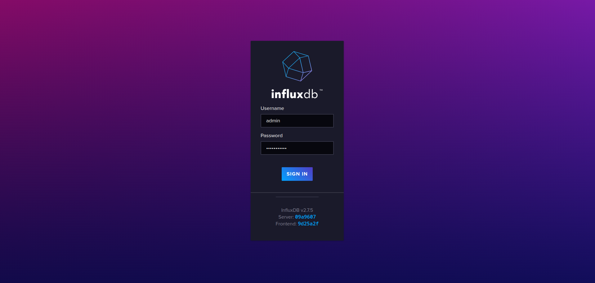
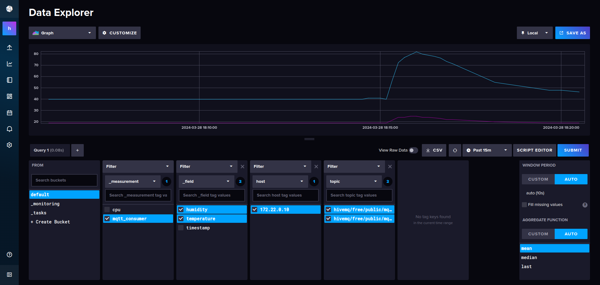
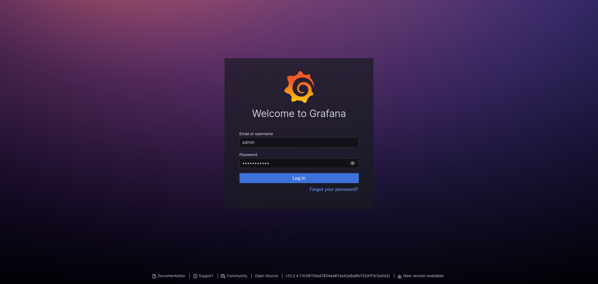
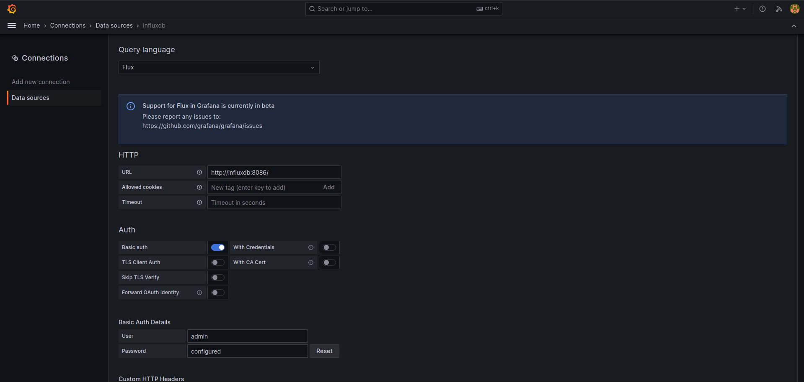
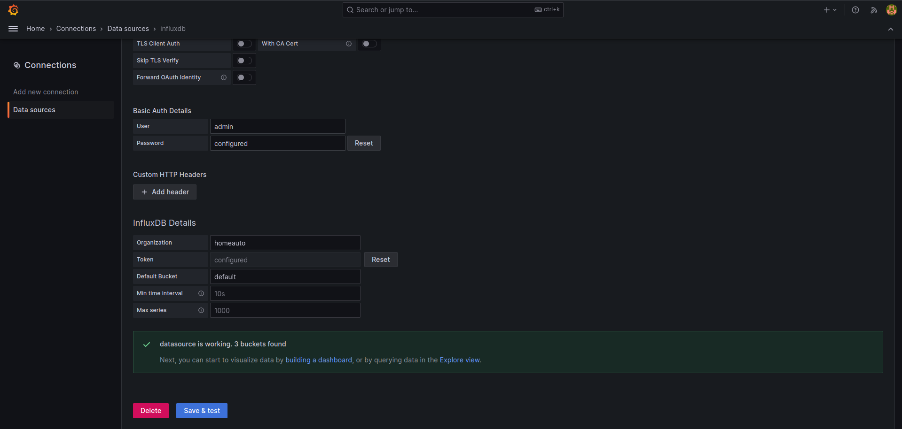

# Parse MQTT Data to Telegraf, Store with InfluxDB and Visualise with Grafana

In the [backend directory](../backend), there is a Docker Compose configuration file for setting up a monitoring stack
using [Telegraf](https://www.influxdata.com/time-series-platform/telegraf/), [InfluxDB](https://www.influxdata.com/),
and [Grafana](https://grafana.com/). This document provides instructions on how to build the images,
spin up the containers, configure data sources, and create dashboards.

## Prerequisites

Before proceeding, ensure you have Docker installed on your system.

## Building images and spinning up containers

Navigate to the [backend repository](../backend) and run the following command to build the different services:

```shell
docker compose build
```

Then, run the following command to spin up the containers:

```shell
docker compose up -d
```

This command will start Telegraf, InfluxDB, and Grafana containers in detached mode. You can verify that the containers
are up and running by running:

```shell
docker ps
```

You should be seeing something similar to this:

```shell
CONTAINER ID   IMAGE                    COMMAND                  CREATED      STATUS       PORTS                                                                     NAMES
f51840a5a61a   grafana/grafana:10.2.4   "/run.sh"                7 days ago   Up 3 hours   0.0.0.0:3000->3000/tcp, :::3000->3000/tcp                                 grafana
e330ba3b16b9   telegraf:1.29.5-alpine   "/entrypoint.sh tele…"   7 days ago   Up 3 hours   8092/udp, 8125/udp, 8094/tcp, 0.0.0.0:8125->8125/tcp, :::8125->8125/tcp   telegraf
fff28833f558   influxdb:2.7.5-alpine    "/entrypoint.sh infl…"   7 days ago   Up 3 hours   0.0.0.0:8086->8086/tcp, :::8086->8086/tcp                                 influxdb
```

## Exploring Data in InfluxDB Data Explorer

Open a web browser and navigate to `http://localhost:8086`. Login in to InfluxDB with the credentials defined in the
[influxdb.env](../backend/influxdb.env) configuration file.



Then go to the "Data Explorer" tab:



Here, you can explore the data that arrive from Telegraf and stored in InfluxDB, execute queries, and visualize metrics.

## Configuring InfluxDB Data Source in Grafana 🚀 

Open a web browser and navigate to `http://localhost:3000`. Login in to Grafana with the credentials defined in the
[grafana.env](../backend/grafana.env) configuration file.



Open the menu from the top left-hand side and go to "Connections" > "Data Sources" > "Add data source". Choose
"InfluxDB" as the type. Configure the following settings:

- Name: Provide a name for the data source.
- Query Language: Flux
- HTTP URL: http://influxdb:8086.
- Auth: Basic auth
- Basic Auth Details: username and password defined in [influxdb.env](../backend/influxdb.env)
- InfluxDB Details:
  - Organization: defined in [influxdb.env](../backend/influxdb.env)
  - Token: defined in [influxdb.env](../backend/influxdb.env)
  - Default Bucket: defined in [influxdb.env](../backend/influxdb.env)



Click "Save & Test" to verify the connection: ✅ 



## Visualise time-series data using Grafana 📊 

In the InfluxDB Data Explorer, choose the data point you would like to plot, e.g. humidity,
click first on "Submit" to explore and then to the "SCRIPT EDITOR" to view the Flux code. For example:

```shell
from(bucket: "default")
  |> range(start: v.timeRangeStart, stop: v.timeRangeStop)
  |> filter(fn: (r) => r["_measurement"] == "mqtt_consumer")
  |> filter(fn: (r) => r["_field"] == "humidity")
  |> filter(fn: (r) => r["host"] == "172.22.0.10")
  |> filter(fn: (r) => r["topic"] == "hivemq/free/public/mqtt/home/kitchen/humidity")
  |> aggregateWindow(every: v.windowPeriod, fn: last, createEmpty: false)
  |> yield(name: "last")
```


Copy this Flux code. In Grafana, create a new dashboard or open an existing one. Add a new panel to the dashboard and
edit the panel. Under the "Query" tab, choose "InfluxDB" as the data source. Paste the copied Flux code into the query
editor. Configure visualization options as needed and click "Apply" to save the panel configuration.


Time to play around! 🎉